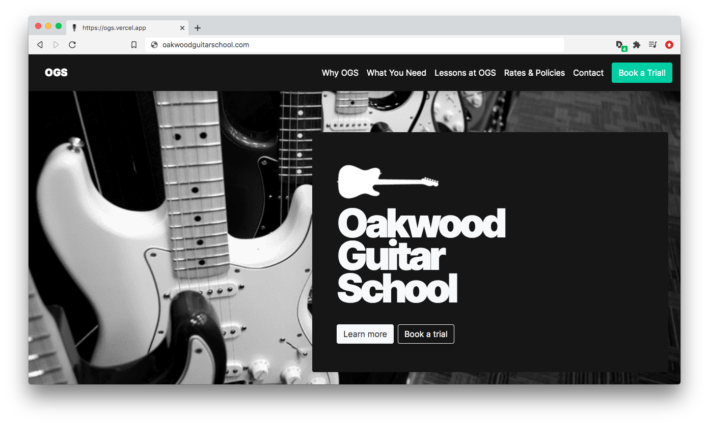

# 🚀 Oakwood Guitar School Official Site

## Official website for Toronto's best guitar school

A website built with React and GatsbyJS for [Oakwood Guitar School](https://oakwoodguitarschoo.com), one of Toronto's premier music schools run by guitarist, performer, educator and producer [Neil Whitford](https://neilwhitford.com/).

## Site structure

The site is built with React, GatsbyJS, and Markdown.  The homepage is standard HTML/jsx, and all sub pages are markdown files that are rendered as HTML. 

## Dependencies

The site relies on `gatsby-source-filesystem`, `gatsby-markdown-remark`, `gatsby-image`, `gatsby-plugin-react-helmet` (SEO), `gatsby-plugin-sass`, `gatsby-plugin-transition-link` (for page transition animations), `gatsby-plugin-catch-links` (for maintaining SPA routing on links within markdown pages), `gatsby-plugin-smoothscroll` (smooth anchor scrolling on homepage).

## Images

Images are contained in the images folder, and are processed and optimized using `gatsby-image`. 

## SEO

SEO meta and social tags are added to the site using `react-helmet` (through gatsby's `gatsby-plugin-react-helmet`), via the `SEO.js` component. Specific tag data (text, urls, and images) is pulled from the gatsby-config.js file's `siteMetadata` field using graphQL.

## Site text content

All content for the Home and Conact pages was put into `text.js` inside the `copy` folder. Content is parsed into sections as `json` and imported so all content can be edited and continually added to in one place.

## Site pages

Sub pages (Why OGS, What You Need, Typical Lesson, etc.) are written in Markdown, so text is hard-coded in each specific page, which makes it relatively easy to edit. Edits to those pages must happen inside the `markdown-pages` folder and to each page individually.

## License

Please see `License.md` for more information.